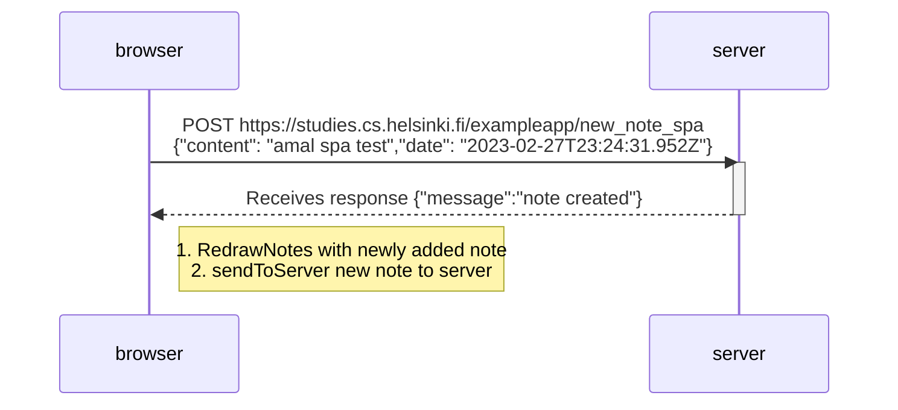

# Single page app
## New Note SPA Sequence

```mermaid
sequenceDiagram
    participant browser
    participant server
    
    browser->>server: POST https://studies.cs.helsinki.fi/exampleapp/new_note_spa<br/>{"content": "amal spa test","date": "2023-02-27T23:24:31.952Z"}
    activate server
    server-->>browser: Receives response {"message":"note created"}
    deactivate server

    Note right of browser: 1. RedrawNotes with newly added note<br/> 2. sendToServer new note to server
```
